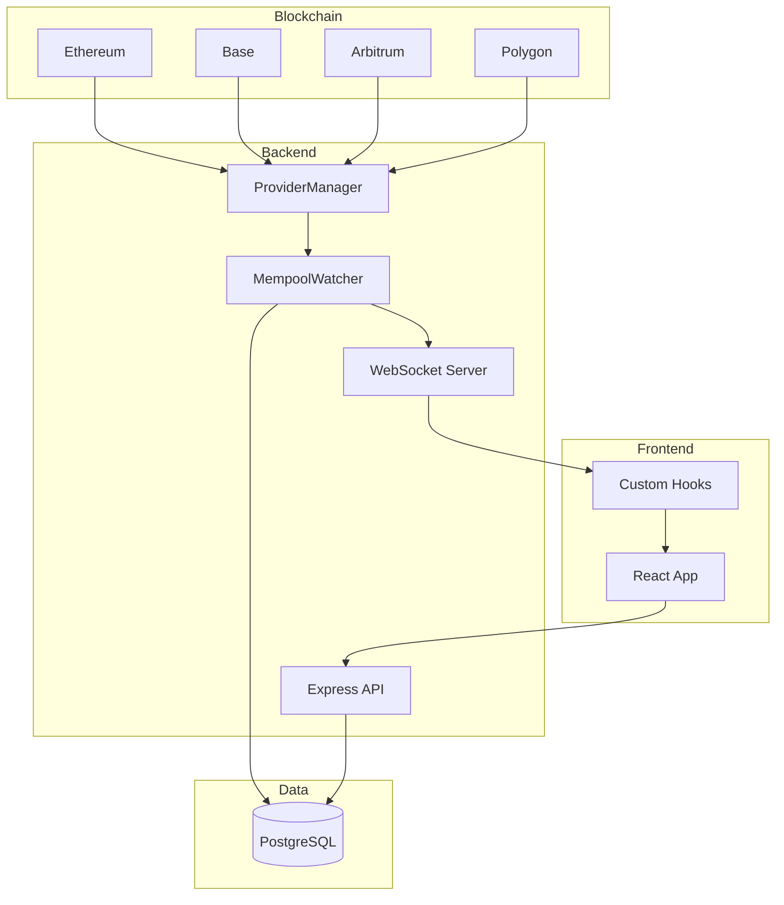
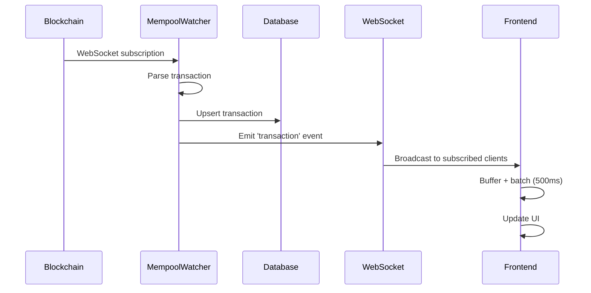
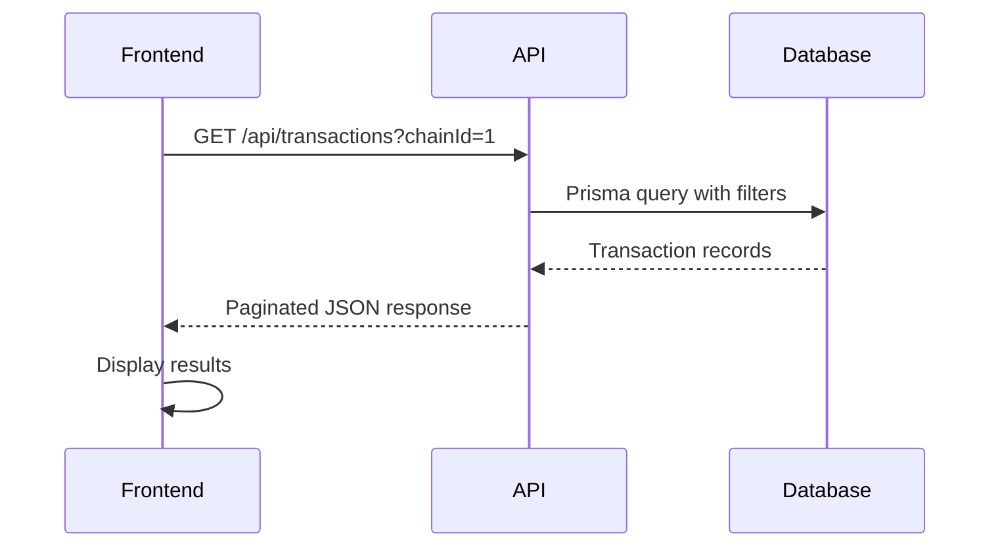

# Codebase Map

> Auto-generated by Cartographer. Last mapped: 2026-01-13

## System Overview

This is a **real-time EVM Mempool Watcher** that monitors blockchain pending transactions via WebSocket subscriptions and provides a web dashboard for visualization.



## Directory Structure

```
mempool/
├── backend/                    # Node.js/TypeScript backend
│   ├── src/
│   │   ├── index.ts           # Entry point - orchestrates all services
│   │   ├── api/routes.ts      # REST API endpoints
│   │   ├── websocket/server.ts # WebSocket broadcaster
│   │   ├── mempool/           # Blockchain monitoring
│   │   │   ├── watcher.ts     # Core mempool watcher (EventEmitter)
│   │   │   └── types.ts       # Transaction types & converters
│   │   ├── providers/         # RPC provider abstraction
│   │   │   ├── manager.ts     # Provider failover logic
│   │   │   ├── registry.ts    # Provider registry
│   │   │   └── providers/     # Alchemy, QuickNode, Infura, Ankr
│   │   ├── db/                # Database layer
│   │   │   ├── client.ts      # Prisma singleton
│   │   │   └── pruning.ts     # Auto-cleanup scheduler
│   │   └── config/chains.ts   # Chain configuration loader
│   └── prisma/schema.prisma   # Database schema
│
├── frontend/                   # React/Vite frontend
│   ├── src/
│   │   ├── App.tsx            # Root component
│   │   ├── components/        # UI components
│   │   │   ├── TransactionCard.tsx
│   │   │   ├── TransactionList.tsx
│   │   │   ├── ChainSelector.tsx
│   │   │   ├── FilterBar.tsx
│   │   │   └── StatsPanel.tsx
│   │   ├── hooks/             # State management
│   │   │   ├── useWebSocket.ts    # WS connection
│   │   │   └── useTransactions.ts # Transaction state + API
│   │   └── types/transaction.ts
│   └── vite.config.ts
│
├── analysis/                   # Python analytics
│   └── analyze.py             # 7 report types
│
├── .github/workflows/          # CI/CD
│   ├── test.yml               # Matrix testing
│   ├── lint.yml               # Code quality
│   └── deploy.yml             # VPS deployment
│
└── docker-compose.yml          # Container orchestration
```

## Module Guide

### Backend Entry Point

**Purpose**: Application orchestrator that wires all services together

**Entry point**: `backend/src/index.ts`

**Key files**:
| File | Purpose | Tokens |
|------|---------|--------|
| `src/index.ts` | Main entry, service orchestration | 1025 |

**Startup sequence**:
1. Load provider configurations from environment
2. Create `ProviderManager` for RPC endpoints
3. Load and validate chain configurations
4. Sync chains to database
5. Create Express app with CORS
6. Create `TransactionBroadcaster` (WebSocket)
7. Create `MempoolWatcher` (blockchain monitoring)
8. Wire watcher events to broadcaster
9. Start server on PORT (default 3001)
10. Start database pruning scheduler

---

### Mempool Module

**Purpose**: Core blockchain monitoring via WebSocket subscriptions

**Entry point**: `backend/src/mempool/watcher.ts`

**Key files**:
| File | Purpose | Tokens |
|------|---------|--------|
| `mempool/watcher.ts` | WebSocket subscription manager | 2266 |
| `mempool/types.ts` | Transaction types & converters | 615 |

**Chain-Specific Subscriptions**:
| Chain | Method | Notes |
|-------|--------|-------|
| Ethereum (1) | `alchemy_pendingTransactions` | Full tx objects |
| Sepolia (11155111) | `alchemy_pendingTransactions` | Full tx objects |
| Polygon (137) | `alchemy_pendingTransactions` | Full tx objects |
| Base (8453) | `alchemy_minedTransactions` | Mined tx objects |
| Arbitrum (42161) | `alchemy_minedTransactions` | Mined tx objects |
| Optimism (10) | `alchemy_minedTransactions` | Mined tx objects |
| Monad (143) | `newHeads` | Requires HTTP fetch |

**Events emitted**:
- `transaction` - New transaction detected
- `connected` - Chain connection established
- `disconnected` - Chain connection lost
- `error` - Connection/parsing error

---

### Providers Module

**Purpose**: RPC provider abstraction with failover support

**Entry point**: `backend/src/providers/manager.ts`

**Key files**:
| File | Purpose | Tokens |
|------|---------|--------|
| `providers/manager.ts` | Provider failover logic | 1053 |
| `providers/registry.ts` | Provider lookup | 255 |
| `providers/types.ts` | Provider interfaces | 368 |
| `providers/providers/*.ts` | Provider implementations | ~1700 |

**Supported providers**:
| Provider | Chains | Notes |
|----------|--------|-------|
| Alchemy | ETH, Base, Arbitrum, Polygon, Optimism, Monad | Primary |
| QuickNode | ETH, Base, Arbitrum, Polygon, BSC, Avalanche | |
| Infura | ETH, Arbitrum, Polygon, Avalanche | No Base! |
| Ankr | ETH, Base, Arbitrum, Polygon, BSC, Fantom | |

**Environment configuration**:
```bash
# Single provider
PROVIDER=alchemy
ALCHEMY_API_KEY=xxx

# Multiple providers (failover)
PROVIDERS=alchemy,quicknode
ALCHEMY_API_KEY=xxx
QUICKNODE_API_KEY=xxx
```

---

### API Module

**Purpose**: REST API for transaction queries

**Entry point**: `backend/src/api/routes.ts`

**Endpoints**:
| Route | Method | Purpose |
|-------|--------|---------|
| `/api/transactions` | GET | Paginated list with filters |
| `/api/transactions/:hash` | GET | Single transaction |
| `/api/stats` | GET | Aggregated statistics |
| `/api/chains` | GET | Configured chains |
| `/api/health` | GET | Health check |

**Query parameters** (`/api/transactions`):
- `chainId`, `from`, `to`, `status` - Filters
- `limit` (max 100), `offset` - Pagination
- `orderBy`, `order` - Sorting

---

### WebSocket Module

**Purpose**: Real-time transaction broadcasting to clients

**Entry point**: `backend/src/websocket/server.ts`

**Protocol**:
```typescript
// Client → Server
{ type: 'subscribe', chains: [1, 8453] }  // Subscribe to chains
{ type: 'subscribe', chains: [] }          // All chains
{ type: 'ping' }                           // Heartbeat

// Server → Client
{ type: 'transaction', data: {...} }
{ type: 'chainStatus', chainId: 1, status: 'connected' }
{ type: 'subscribed', chains: [1, 8453] }
{ type: 'pong' }
```

---

### Database Module

**Purpose**: PostgreSQL storage with Prisma ORM

**Key files**:
| File | Purpose | Tokens |
|------|---------|--------|
| `db/client.ts` | Prisma singleton | 112 |
| `db/pruning.ts` | Auto-cleanup (24h retention) | 371 |
| `prisma/schema.prisma` | Database schema | 285 |

**Schema**:
```
Transaction: id, hash (unique), chainId, from, to, value, gasPrice,
             gasLimit, maxFeePerGas, maxPriorityFeePerGas, input,
             nonce, type, timestamp, status

Chain: id, name (unique), wsUrl, rpcUrl, active
```

---

### Frontend Application

**Purpose**: React dashboard for real-time transaction monitoring

**Entry point**: `frontend/src/main.tsx` → `frontend/src/App.tsx`

**Key files**:
| File | Purpose | Tokens |
|------|---------|--------|
| `App.tsx` | Root orchestration | 1206 |
| `hooks/useWebSocket.ts` | WS connection + reconnect | 825 |
| `hooks/useTransactions.ts` | State + API + batching | 1086 |
| `components/TransactionCard.tsx` | TX display | 1080 |

**Component hierarchy**:
```
App
├── ChainSelector (chain filter buttons)
├── StatsPanel (statistics cards)
├── FilterBar (search input)
└── TransactionList
    └── TransactionCard[] (individual txs)
```

**Key patterns**:
1. **Transaction batching**: Buffer in ref, flush every 500ms (max 2 renders/sec)
2. **Live mode toggle**: `isLive` flag blocks WS updates during search
3. **Auto-reconnect**: Exponential backoff (1s → 30s max)

---

### Analysis Module

**Purpose**: Python scripts for transaction analytics

**Entry point**: `analysis/analyze.py`

**Reports**:
1. `summary` - Overview statistics
2. `chains` - Per-chain breakdown
3. `gas` - Gas price analysis
4. `senders` - Top sender addresses
5. `contracts` - Contract interaction stats
6. `hourly` - Time-based analysis
7. `all` - Complete report

---

## Data Flow

### Transaction Ingestion



### API Query Flow



## Conventions

### Code Style
- **TypeScript**: Strict mode, ESM modules (`.js` extensions in imports)
- **React**: Functional components, custom hooks for state
- **Naming**: PascalCase components, camelCase functions, SCREAMING_SNAKE constants
- **Testing**: Vitest, 70% coverage minimum

### BigInt Handling
All large numbers (value, gasPrice, etc.) stored as strings to avoid JS precision loss:
```typescript
const valueInEth = (BigInt(tx.value) / BigInt(10 ** 18)).toString();
```

### Error Handling
- API errors return appropriate HTTP status codes
- WebSocket errors logged but don't crash
- Database constraint violations silently ignored (deduplication)

## Gotchas

### Backend

1. **Chain subscription methods are hardcoded** in `SUBSCRIPTION_CONFIG` - not configurable
2. **Provider order matters** - first provider is primary, order determines failover
3. **Chain numbering must be sequential** (1, 2, 3...) - gaps stop loading
4. **WebSocket URL must start with `wss://`** - validation will fail otherwise
5. **Database pruning is hardcoded** - 24-hour retention, no configuration
6. **Empty `subscribedChains` set means ALL chains** - not no chains
7. **Reconnect uses fixed 5-second delay** - no exponential backoff
8. **Infura doesn't support Base** - use Alchemy or QuickNode

### Frontend

1. **`isLive` flag blocks WS updates during search** - prevents pollution
2. **Transaction batching** - max 2 renders/sec regardless of stream rate
3. **`subscribeToChains([])` means all chains** - confusing but intentional
4. **BigInt required for calculations** - JS Number loses precision

### Deployment

1. **deploy.yml uses `git reset --hard`** - local VPS changes destroyed
2. **Port mismatch** - Backend 3001→3002, Frontend 80→3003
3. **Codecov only from Node 20.x** - prevents duplicate uploads

## Navigation Guide

**To add a new chain**:
1. Add chain config in environment: `CHAIN_N_NAME`, `CHAIN_N_ID`
2. Add provider support in `backend/src/providers/providers/*.ts`
3. Add subscription method in `backend/src/mempool/watcher.ts` `SUBSCRIPTION_CONFIG`
4. Add explorer URL in `frontend/src/components/TransactionCard.tsx` `getExplorerUrl`

**To add a new RPC provider**:
1. Create `backend/src/providers/providers/newprovider.ts` implementing `RpcProvider`
2. Register in `backend/src/providers/registry.ts`
3. Add to `ProviderName` type in `backend/src/providers/types.ts`

**To add a new API endpoint**:
1. Add route in `backend/src/api/routes.ts`
2. Add corresponding fetch function in `frontend/src/hooks/useTransactions.ts`

**To modify the database schema**:
1. Edit `backend/prisma/schema.prisma`
2. Run `npm run db:migrate` to generate migration
3. Run `npm run db:generate` to regenerate Prisma client

**To add a new frontend component**:
1. Create component in `frontend/src/components/`
2. Add tests in same directory with `.test.tsx` suffix
3. Import and use in `App.tsx` or parent component

## Tech Stack

| Layer | Technology |
|-------|------------|
| Backend Runtime | Node.js + TypeScript |
| Backend Framework | Express |
| Database | PostgreSQL + Prisma |
| WebSocket | ws library |
| Blockchain | viem (types only) |
| Frontend | React 18 + TypeScript |
| Build Tool | Vite |
| Styling | Tailwind CSS |
| Testing | Vitest + Testing Library |
| CI/CD | GitHub Actions |
| Deployment | Docker Compose |

## External Dependencies

| Service | Purpose | Required |
|---------|---------|----------|
| Alchemy/QuickNode/Infura/Ankr | RPC WebSocket endpoints | Yes (at least one) |
| PostgreSQL | Transaction storage | Yes |
| Docker | Container runtime | Production only |
